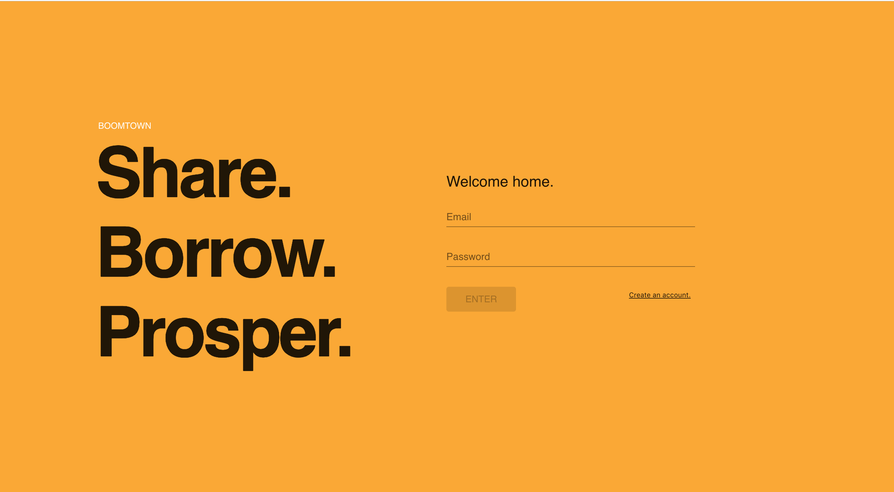

# Boomtown 🏙

## Description

A full-stack web application built for online item sharing. Users can sign-up to share items with other users. They can upload the information for an item that they are willing to share through a form, view the items that the other users have shared and borrow items if they wish to do so.

## Server

### Technologies Used

- Node.js
- Express
- GraphQL
- PostgreSQL
- Postico

### Setup

Run the following commands in the server directory.

#### Installation

```bash
npm install
```

#### Run

```bash
npm run start:dev
```

### How to Use


- Once the setup is complete, you can enter the url stated in your terminal as 'express running: url' to your browser and access the GraphQL playground.

- Here you can enter queries as seen in the screen shot above and see what the database returns with the implemented schema and resolvers.

## Client

### Technologies Used

- Node.js
- React.js
- Redux
- Final-Form
- Material-UI
- Gravatar
- Apollo Client

### Setup

Run the following commands in the client directory.

#### Installation

```bash
npm install
```

#### Run

```bash
npm start
```

### How to Use



- Once you run the commands listed above, a browser window will start running the website from your localhost.

## Author

Emre Kaynak (LinkedIn: www.linkedin.com/in/emre-kaynak-1381a6168)

## Personal Learning and Experience

Boomtown was the first project I have done, as a part of the RED Academy Application Developer program. Also my first experience in developing back-end side of a web application. Through this project I have learned a great deal about databases, http requests and how servers hadle them. It was also my first time using React.js for front-end development. Overall this project was a great experience and I believe these tools will contribute greatly to my full-stack development skills.
